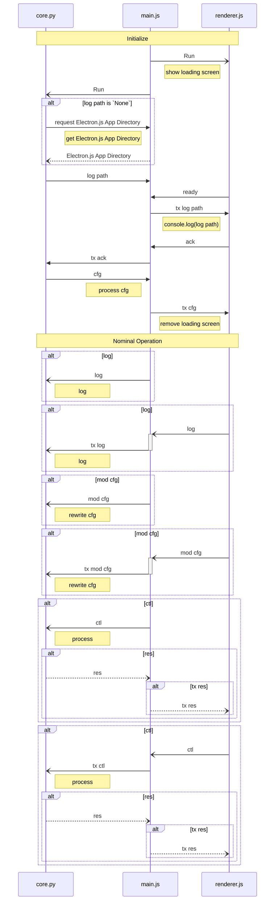

<h1 align="center" style="font-weight: bold">
    Considerations for Future Feature Implementation
</h1>

The headers are sorted depending on their status, priority, and whatnot


<div class="toc"><h2 id="toc"><b><a href="#toc">Table of Contents</a></b></h2>
<ul><li><a href="#columns">Columns</a></li><li><a href="#tables">Tables</a></li><li><a href="#css">CSS</a></li><li><a href="#gui">GUI</a></li><li><a href="#implemented-features">Implemented Features</a></li><li><a href="#page-breaks">Page Breaks</a></li></ul></div>

<h2 id="columns"><b><a href="#columns">Columns</a></b></h2>

Before this project can even convert markdown to PDF files in sub-ten seconds, I have been using tables as substitute for columns. This is as the Commonmark Markdown specification does not support such feature.

However, there is a simple problem with tables in markdown: *it does not support multi-line cells*

Time and time again, I have searched for ways to be able to write multi-line cells in a kind of markdown way. All of them are ugly implementations. None of them can satisfy me.

And then I came across [MultiMarkdown's table documentation](https://fletcher.github.io/MultiMarkdown-5/tables.html) which makes an interesting observation:

> If you need complex tables you will need to create them by hand or with a tool specifically designed for your output format. At some point, however, you should consider whether a table is really the best approach if you find MultiMarkdown tables too limiting.

And I think that *that* is true.

However, I have thought of a solution. That is to parse markdown inside HTML tags. Such as that the following markdown...

```html
<table>
    <tr>
        <th>Header</th>
    </tr>
    <tr>
        <td>
            - Lorem ipsum dolor sit amet
            - Consectetur adipiscing elit
            - Integer molestie lorem at massa
        </td>
    </tr>
</table>
```

...will be converted to HTML like the following:

```html
<table>
    <tr>
        <th>Header</th>
    </tr>
    <tr>
        <td>
            <ul>
                <li>Lorem ipsum dolor sit amet</li>
                <li>Consectetur adipiscing elit</li>
                <li>Integer molestie lorem at massa</li>
            </ul>
        </td>
    </tr>
</table>
```

But, I think that the best solution would be to just make my own implementation of columns.

A solution I am considering at the time of writing is using a custom HTML tag called `cols` (stands for columns) that wraps `col` (stands for column) tags, which in turn wraps content in a column. Such as that the following markdown leads to 3 columns.

```html
<cols>
    <col>
        Column #1
    </col>
    <col>
        Column #2
    </col>
    <col>
        Column #3
    </col>
</cols>
```

And yes, the content inside each `col` tags will be interpreted as markdown.

<h2 id="tables"><b><a href="#tables">Tables</a></b></h2>

Despite the talk about the tables above, there is still a legitimate reason to use multi-line tables, such as shitty homeworks that requires such. And more often than not, these tables are multi-line.

And as such, I have thought to actually implement interpreting content inside table cells as markdown, as discussed above. The rationale for this is that while it strays from the actual purpose of using HTML inside of markdown, this can ease up using multi-line tables.

And yes, an option to turn this shitty feature off.

I hate that I have to do these because of school works. No, this is the point of this whole damn thing: to make writing my home works more efficient. But I hate going to school. I barely have time to talk to my girlfriend. But what am I saying right here? Considering that nobody will be able to read this far in this nest of documentation, I doubt that someone will see this. But I digress.

<h2 id="css"><b><a href="#css">CSS</a></b></h2>

I have a really grand plan: to parameterize common CSS rulesets.

<h2 id="gui"><b><a href="#gui">GUI</a></b></h2>

I do not have proper plans for the GUI of this project yet. But boredom does wonders.

I was once subjected to the horrors of national achievement test and mock exams for 4 days. And we are not allowed to use our phones for 4-5 hours straight a day, for 4 days. And so, I scribbled to a scratch paper that I had. And what do you know, I have this graph.

A week later, I graphed the thing in mermaid.js, and here it is:



<h2 id="implemented-features"><b><a href="#implemented-features">Implemented Features</a></b></h2>

<details>
<summary>Hereunder this heading are implemented features.</summary>
Now, why have not I put the implement features under this header? As it will break the link to other documents.
</details>

<h2 id="page-breaks"><b><a href="#page-breaks">Page Breaks</a></b></h2>

> Implemented in 0.0

There is no plain markdown way to add pagebreak in a markdown file. However, I came across [this stackoverflow answer](https://stackoverflow.com/a/57578831) that mentions that the answer-er uses `<<<<>>>>` to denote pagebreak in their documents. And I liked that! And as such, I think I will implement just that in later versions of this program.
