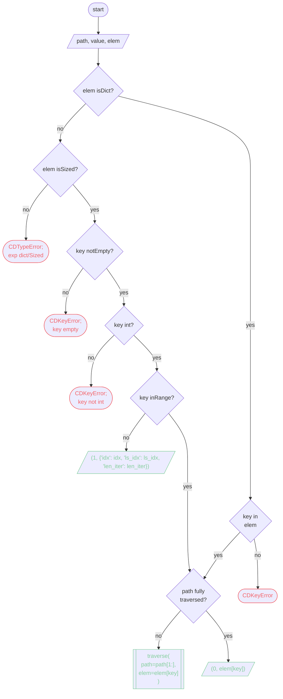

# **[src](../index.md).[utils](../utils.md).[cd](cd.md)**

    

    
<h2><b><a href="#func" id="func">Functions</a></b></h2>

    

    
<h3><b><a href="#func-test" id="func-test">test</a></b></h3>

```python
() ‑> None
```

    

    
<h2><b><a href="#class" id="class">Classes</a></b></h2>

    
<h3><b><a href="#class-BEHAVIOR" id="class-BEHAVIOR">BEHAVIOR</a></b></h3>

```python
(value, names=None, *, module=None, qualname=None, type=None, start=1)
```

    
An enumeration.

    
<h3><b><i><a href="#class-BEHAVIOR-mro" id="class-BEHAVIOR-mro">Ancestors (in MRO)</a></i></b></h3>

* enum.Enum

    
<h3><b><i><a href="#class-BEHAVIOR-cvar" id="class-BEHAVIOR-cvar">Class variables</a></i></b></h3>

    
`append`

    
`insert`

    
`modify`

    
<h3><b><a href="#class-CustomDict" id="class-CustomDict">CustomDict</a></b></h3>

```python
(*args, **kwargs)
```

    
Custom dictionary.

    
<h3><b><i><a href="#class-CustomDict-mro" id="class-CustomDict-mro">Ancestors (in MRO)</a></i></b></h3>

* builtins.dict

    
<h3><b><i><a href="#class-CustomDict-func" id="class-CustomDict-func">Methods</a></i></b></h3>

    

    
<h3><a href="#class-CustomDict-func-dir" id="class-CustomDict-func-dir">dir</a></h3>

```python
(self, path: str = 'c0VjUmVUX2NPZEUgYnkgd2hpX25l', de: Any = 'c0VjUmVUX2NPZEUgYnkgd2hpX25l', sep: str = '/') ‑> Any
```

    

    

    
<h3><a href="#class-CustomDict-func-traverse" id="class-CustomDict-func-traverse">traverse</a></h3>

```python
(self, path: str, elem: Union[dict[str, Any], Sized], sep: str, idx: int = 0, og_path: str | None = None) ‑> Union[tuple[int, Union[Any, dict[str, int]]], Any]
```

    
_summary_.

Return States
| State \||                              Return Type \||                       Description |
|--------:|-------------------------------------------:|:----------------------------------|
|     0 \||                       Any (Indexed Item) \|| Path fully traversed              |
|     1 \||   dict[str, int] (Kwargs for CDKeyError) \|| Path's not in element             |
|     2 \|| dict[str, int] (Kwargs for CDIndexError) \|| Path's current index not in range |

Callback States
| State \||                             Arguments Type \||                                Description |
|--------:|---------------------------------------------:|:-------------------------------------------|
|     0 \||  dict (Indexed Item), str (key), int (idx) \||  Path fully traversed; Element type `dict` |
|     1 \|| Sized (Indexed Item), int (key), int (idx) \|| Path fully traversed; Element type `Sized` |

    
<h3><i><a href="#class-CustomDict-func-traverse-args" id="class-CustomDict-func-traverse-args">Args:</a></i></h3>

    path (str): _description_
    elem (dict[str, Any] | Sized): _description_
    sep (str): _description_
    idx (int, optional): _description_. Defaults to 0.
    og_path (Optional[str], optional): _description_. Defaults to None.

    
<h3><i><a href="#class-CustomDict-func-traverse-raises" id="class-CustomDict-func-traverse-raises">Raises:</a></i></h3>

    CDKeyError: _description_
    CDKeyError: _description_
    CDKeyError: _description_
    CDIndexError: _description_
    CDTypeError: _description_

    
<h3><i><a href="#class-CustomDict-func-traverse-returns" id="class-CustomDict-func-traverse-returns">Returns:</a></i></h3>

    Any: _description_

