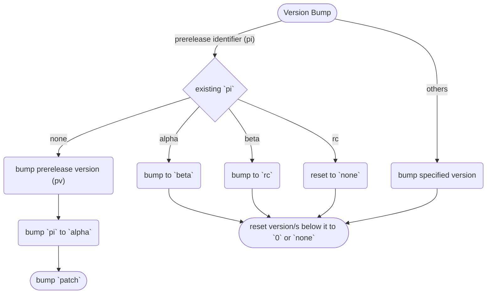

<h1 align="center" style="font-weight: bold">
    Notes to Self
</h1>

Look, whi_ne, I have written this for you.

Please, do I humbly plead you, do not ever forgot to read this before pushing changes to Github. Or like, just look at this once in a while. This is your holy bible.


<div class="toc"><h2 id="toc"><b><a href="#toc">Table of Contents</a></b></h2>
<ul><li><a href="#file-naming-conventions">File Naming Conventions</a><ul><li><a href="#file-naming-conventions-markdown">Markdown</a></li><li><a href="#file-naming-conventions-python">Python</a></li></ul></li><li><a href="#file-contents-naming-conventions">File Contents Naming Conventions</a><ul><li><a href="#file-contents-naming-conventions-python">Python</a><ul><li><a href="#file-contents-naming-conventions-python-dos">DOs</a></li><li><a href="#file-contents-naming-conventions-python-don-ts">DON’Ts</a></li></ul></li></ul></li><li><a href="#versioning-system">Versioning System</a><ul><li><a href="#versioning-system-version-bump-guides">Version Bump Guides</a></li></ul></li><li><a href="#changelog">Changelog</a></li><li><a href="#documentation">Documentation</a></li></ul></div>

<h2 id="file-naming-conventions"><b><a href="#file-naming-conventions">File Naming Conventions</a></b></h2>

<h2 id="file-naming-conventions-markdown"><b><i><a href="#file-naming-conventions-markdown">Markdown</a></i></b></h2>

For markdown files

<h2 id="file-naming-conventions-python"><b><i><a href="#file-naming-conventions-python">Python</a></i></b></h2>

**DOs**

- PEP 8 recommends using lowercase letters for module names

<h2 id="file-contents-naming-conventions"><b><a href="#file-contents-naming-conventions">File Contents Naming Conventions</a></b></h2>

<h2 id="file-contents-naming-conventions-python"><b><i><a href="#file-contents-naming-conventions-python">Python</a></i></b></h2>

Hereunder is the summary of [PEP 8 naming conventions](https://peps.python.org/pep-0008/#naming-conventions).

<h2 id="file-contents-naming-conventions-python-dos"><a href="#file-contents-naming-conventions-python-dos">DOs</a></h2>

- Use lowercase letters for variable and function names, and separate words with underscores (_).
- Use uppercase letters for constant variables, and separate words with underscores (_).
- Use **CamelCase** notation for naming classes.
- Prefix private variables and functions with a single underscore (_), and use double underscores (__) for name mangling.

<h2 id="file-contents-naming-conventions-python-don-ts"><a href="#file-contents-naming-conventions-python-don-ts">DON’Ts</a></h2>

- Avoid using single-character variable names except for counters and iterators.
- Avoid using names that have special meaning in Python, such as "list" or "str".

<h2 id="versioning-system"><b><a href="#versioning-system">Versioning System</a></b></h2>

Look, you have made your own versioning system based off semver 2.0.0. Use it properly.

Given a version number `user`.`dev`.`minor`.`patch`, increment the:

- `user` version when you make any changes to the user interface/experience.

    Hereunder are exceptions for user experience changes that invokes a `user` version bump:

    - Performance gains (that might improve )

- `dev` version when you make incompatible API changes,
- `minor` version when you add functionality in a backwards compatible manner, and
- `patch` version when you make backwards compatible bug fixes.

If in doubt, please **DO** visit [semver.org](https://semver.org/).

<h2 id="versioning-system-version-bump-guides"><b><i><a href="#versioning-system-version-bump-guides">Version Bump Guides</a></i></b></h2>

- **ANY** change in the user interface/experience SHALL induce a `user` version bump.
- **ANY** change in the schema shall induce a `dev` version bump.
- **ANY** change in the documentation SHALL NOT induce any version bump.



<h2 id="changelog"><b><a href="#changelog">Changelog</a></b></h2>

As used in the changelog, the following types of changes shall have the following implications, of which, their allowed version bumps should be everything, unless explicably stated otherwise:

- `Added` for new features.
    - user
    - dev
    - minor
- `Changed` for changes in existing functionality.
    - user
    - dev
- `Deprecated` for soon-to-be removed features.
    - patch
- `Removed` for now removed features.
    - user
    - dev
- `Fixed` for any bug fixes.
- `Security` in case of vulnerabilities.

Mind the human as you do with the robot. Format the changelog properly. Example format:

```md
## 69.4.2.0 (minor bump)

Sprinkle a description here.

### Added

- I added a cool feature.

### Deprecated

- This feature will be deprecated 'cuz I can't maintain it anymore.

### Security

- Fixed stuff where the anilist token is leaked to everyone using this app.
```

<h2 id="documentation"><b><a href="#documentation">Documentation</a></b></h2>

The documentation system is a custom solution.

If the documentation generator fails, check the traceback. It is commonly due to errors in the code and not the generator itself.

Do not blame the shitty generator you wrote. You might just have written a faulty code.
